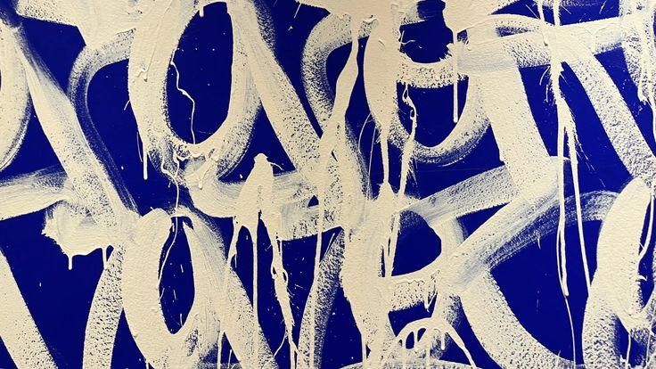
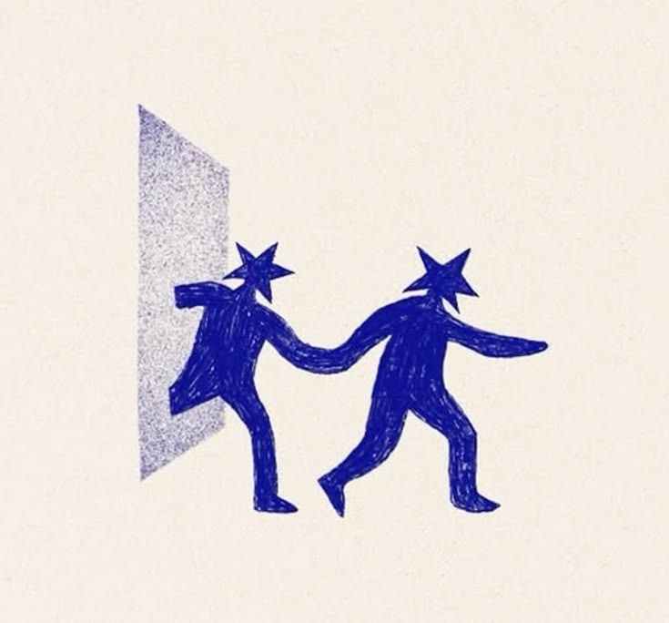

<h1 style="font-size: 40px;">Welcome, traveler!</h1>

  

 
 

  
<h4> Hark! I am Sultane, a digital sorcerer forged in the rigorous dungeons of UM6P 1337 (and a recovering wanderer from the Higher School of Technologies).  
I used to just write normal code, but now I build literal armies of AI Agents (check out <code>legal_agent</code> and <code>agenwiki</code>) to do my bidding while I sip coffee. When I'm not casually reinventing the wheel by writing HTTP servers from scratch in C++, I'm out here strapping the Model Context Protocol (MCP) to FastAPI (<code>mcp_for_fastapi</code>) just to see what kind of magic happens.   
I speak Python to the AIs, C/C++ to my segfaults, and enough web dev (JS/HTML/CSS) to make it look like I know what I'm doing. I also know Java and PHP, but my therapist said we shouldn't talk about those dark times anymore.
</h4>

 
 
 

   <h3>Feel free to explore my repositories where I share my labor of love, passion for the craft, and the occasional loss of my sanity.</h3>

  
 

  

  
 

  

<!-- Add your social media links here -->

  
  
  

 
